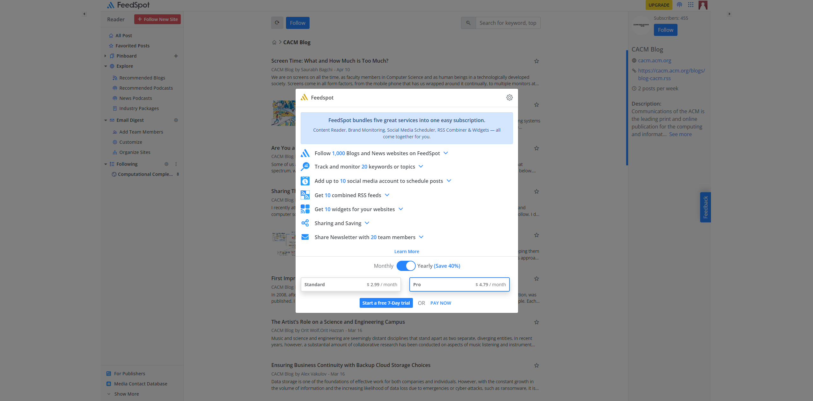
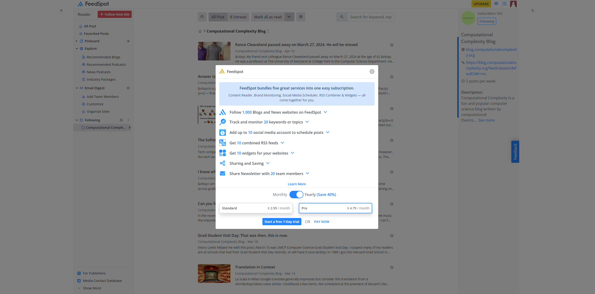
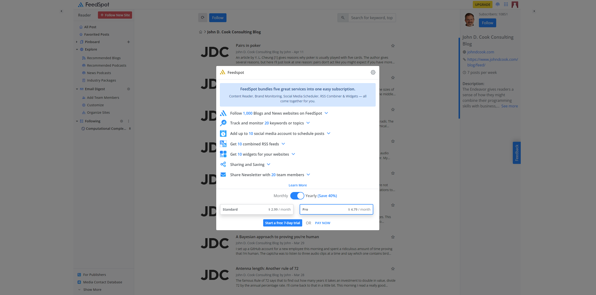
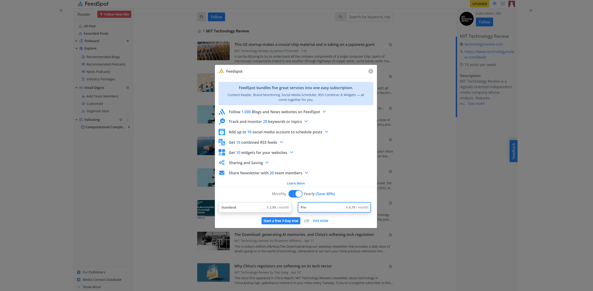
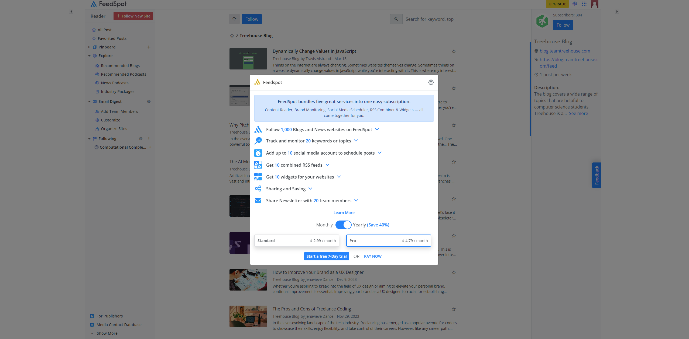
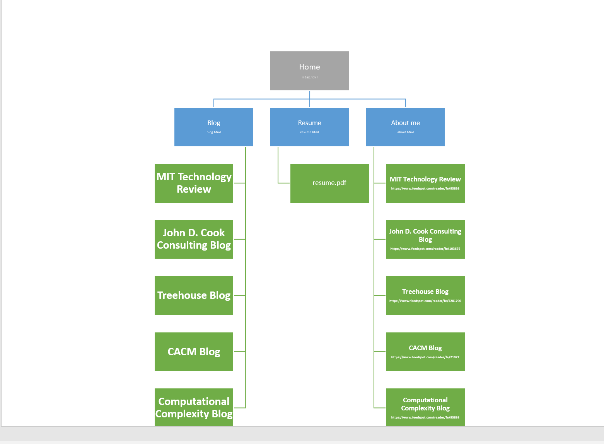

# Mina Bishay's Portfolio Website

- **GitHub Repository:** [My Portfolio Repo](https://github.com/Minabishay123/Minabishay_T1A2)

## Description

My portfolio website is designed to showcase my skills, projects, and expertise in software development and IT. The website serves as a professional platform for me to present my work, share my insights through a blog, and provide access to my resume.

### Purpose

The purpose of this portfolio website is to:

- Display my passion for technology and commitment to excellence.
- Showcase hmy expertise in various programming languages, frameworks, and development tools.
- Provide a platform to demonstrate my creativity, problem-solving abilities, and dedication to continuous learning.
- Serve as a gateway for potential employers or clients to learn more about my  capabilities.

### Functionality / Features

- **Homepage:** Introduces my professional journey, highlighting my dedication to technology and innovation.
- **Blog:** Features my latest blog posts on topics related to technology, software development, and IT.
- **Resume:** Allows visitors to view my resume directly on the website.
- **About Me:** Provides additional information about me, my background, and my interests.

### Screenshots for blog post urls

### Sitemap

- **Home:** Introduction to Mina Bishay
- **Blog:** Latest blog posts
- **Resume:** Mina's resume
- **About Me:** Additional information about Mina
- 

### Target Audience

The target audience for my portfolio website includes:

- Potential employers looking to hire a skilled software developer or IT professional.
- Clients seeking expertise in software development for their projects.
- Peers and fellow developers interested in Mina's work and insights.

### Tech Stack

- HTML
- CSS
